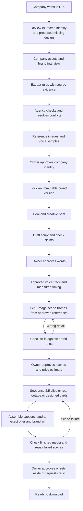

# Brand control and production workflow

September 9, 2026. Implementation plan for discussion, building on `APP-REVIEW.md` and superseding conflicting provider priorities in `BUILD-PLAN.md`.

## Decisions confirmed by Trevor

- OpenAI / ChatGPT image generation is the preferred image family.
- Seedance 2.5 is the preferred video model.
- Each company may approve real employees, recurring synthetic characters, or both.
- Brand accuracy is a primary requirement, including the precise people, garments, marks, products, vehicles, voice, and claims.
- Company setup must support pasting a website URL and building a proposed design system when existing assets are sparse. Firecrawl is the preferred extraction candidate; see [WEBSITE-BRAND-SETUP.md](WEBSITE-BRAND-SETUP.md).

The implementation phases and acceptance criteria below are recommendations. No live provider, database, or billing change has been made by this document.

## Current workflow, as implemented

Home → New ad / sample brief → editable sample script → sample scene cards → sample finished-ad queue → local approve, redo, or skip. Brand Room provides six sample books and an unsent change-request dialog. The words gate must be approved before the scene gate. Home and navigation counts follow local decisions. Reloading resets the session.

There is no active source-kit ingestion, script generation, voice generation, still generation, video generation, automatic media checking, durable approval, or publication. Auth is also absent. The stored SQL migrations are a starting schema, not proof of a working production service.

## Proposed production workflow

Two connected processes: a company setup loop that builds approved references, and an ad production loop that reuses them.

Social publishing remains a separate later capability. A successful render or owner approval does not mean an ad was published.

## Make each suggestion stronger

| Area | Concrete implementation | Acceptance check |
| --- | --- | --- |
| Creation sequence | Keep Brief → Words → Scenes → Generate as the owner path. Internally, measured voice and checked stills sit between Words and Scenes. The Scenes gate shows the images that will actually be animated, the timing, and a dollar estimate. | A client request cannot submit video until the server confirms approved words, current still checks, approved scenes, and the pinned brand version. |
| Duration | Use estimated speaking pace only while drafting. After word approval, create or ingest the approved voice track, measure it, and allocate scenes to that audio. Reserve explicit end-card and pause time. If it does not fit, shorten the script or change duration with owner approval. | Every spoken segment fits its scheduled interval. Total output length and end-card time match the approved plan. Editing words invalidates audio, timing, scenes, and downstream approval. |
| Skipped ads | Rename the owner action Set aside for later. Keep the job ready for approval; record a reversible queue disposition separately. Add Ready / Set aside / Approved views and a completion summary. | A skipped ad is visible after reload, can be restored, and is never labeled Being redone. Its allowance and media remain unchanged. |
| Navigation | Proposed initial owner nav: Home, New ad, Approvals, Brand room, Finished ads. Put offer editing inside Home/New ad. Reintroduce other destinations when useful functionality exists. | Every visible primary destination performs its stated task. No placeholder-only destinations in the launch owner nav. |
| Brand Room | Each rule shows its exact source, agency verification, owner approval, and version. Add a comparison viewer with approved reference on one side and candidate output on the other. | An image or rule with missing or contradictory evidence cannot become a locked generation reference. |
| Company separation | Add composite workspace constraints to linked tenant rows, server membership checks, and workspace-scoped storage paths. Test users with one and multiple memberships. | Reject cross-company references even when an agency user belongs to both companies. |
| Brand immutability | Guard the version and its entities, outfits, voices, traits, reference links, and deletes. Preserve source file bytes with hashes and immutable object versions. Change requests create a successor draft. | Updating a company kit cannot silently change an existing job's people, voice, claims, or reference files. |
| Invitations | Accept invitations through an authenticated, transactional path for both new and existing accounts; validate email, expiry, and prior acceptance. | An existing account can join a second company without creating another account; replaying acceptance is harmless. |
| Approval and allowance | Store decisions and events transactionally. Separate quality repair from a materially new brief. Use unique request identifiers for job creation and final generation. | Retrying a request creates one job and one allowance event. Repairing the same approved brief does not consume another unit. |

The current sample script is 63 whitespace-separated words. At 140 words/minute it needs about 27 seconds before pauses. A 24-second ad with a 1.5-second reserved end card has room for at most about 52 words at that pace before additional pauses. The current static check panel must not become production evidence.

The four owner script labels are sections, not necessarily four shots. Split approved copy into timed spoken segments; a section may cover several scenes. The five-scene reference can therefore stay, but each scene must explicitly reference its spoken segment or be marked silent. This replaces the conflicting rule that assumes exactly one scene per displayed script block.

## How branding gets dialed in

Website setup adds a guided entry point: paste URL, review observed branding, keep or improve the look, preview the proposed design system, and approve a version. It supports small companies without complete kits. Website facts, generated suggestions, and owner approvals stay distinct. See [the website setup specification](WEBSITE-BRAND-SETUP.md) for screens, starter outputs, architecture, and acceptance checks.

### 1. Keep verified originals and approved derived references distinct

Original assets include logos, specifications, employee photos, approved voice recordings, vehicle artwork, and real footage. Derived assets include cleaned cutouts, dressed character references, scene frames, and generated clips. A generated interpretation never silently becomes proof of what the real product or employee looks like.

Store an asset ID, workspace ID, hash, version, source, permitted uses, and approval state. A job pins the approved brand version, offer revision, script revision, voice revision, reference hashes, and provider configuration. New versions do not mutate previous work.

### 2. Give each book enforceable fields

| Book | What must be captured and approved | How it is used |
| --- | --- | --- |
| Core identity | Master vector logos, variants, exact written name, typefaces, colors, clear space, minimum legible size | Exact end cards, captions, offer layouts, logo inspection. A shared identity layer referenced by all six books. |
| Cast | Real or synthetic identity, approved angles, facial details, hairstyle, permitted appearance changes, assigned voice, allowed roles | Select only approved person IDs and references. Never invent a replacement employee when a route is unavailable. |
| Wardrobe | Outfit-to-person relationship, garment color/material, front/back details, logo artwork and physical placement | Generate and approve dressed references once, then reuse them across ads. Wrong colors or altered marks fail the relevant check. |
| Products | SKU, dimensions/proportions, grille count, handles, locks, finishes, permitted views, specification citations | Use exact product photos, real footage, or stable compositions. Countable facts are required checks, not descriptive adjectives. |
| Fleet and site | Actual vehicle type, wrap artwork, phone numbers, side/rear views, site signage | Preserve lettering using real footage or approved stable artwork. Avoid generating new wrap text. |
| World | Approved local settings, architecture, seasons, light, camera style, forbidden environments | Keep the company in recognizable surroundings. Product visibility overrides camera-style preferences. |
| Voice and proof | Approved voice ID or recording, pronunciation, pace, tone, example lines, approved claims and evidence, offer terms and expiry | Keep speaker identity and wording consistent. No invented certifications, project counts, warranties, testimonials, or prices. |

The core identity layer can live alongside the existing six-book presentation without requiring a seventh owner-facing card.

### 3. Separate exact requirements from creative freedom

- **Exact:** written marks, price and terms, product geometry/counts, identity, voice assignment, and required disclosures. Prefer real assets or designed overlays when reproduction needs to be exact.
- **Controlled:** outfit fit, color under lighting, local setting, camera behavior, framing. Define allowed ranges and examples and compare against references.
- **Flexible:** hook angle, pacing within the approved timing, permitted background action, and music choice.

A prompt that says “stay on brand” is not an acceptance test. A scene instruction should identify the approved person, outfit, product, location, source images, camera rule, and permitted variation explicitly.

### 4. Approve a reusable reference package

For each initial company, propose one approved spokesperson, two outfits, one key product, one vehicle when relevant, a small location set, a voice sample, and one approved deal. Expand this after the first package produces reliable results. Missing optional assets disable only recipes that require them.

Use OpenAI images to prepare candidate references and scene frames from those originals. Show front/side/detail views and compare them at full resolution. Once a person in an outfit is approved, select those exact dressed references instead of regenerating the identity and wardrobe from scratch for each ad. The agency resolves disagreements; the owner signs off on the company identity package.

### 5. Check images before paying for video

Each output gets individual rule verdicts: pass, fail, not visible, or needs review, with evidence crops and the method used. A mark that is too small to read is not a passed logo check. A strong style score cannot cancel an incorrect logo or price.

For stills, inspect likeness against the approved reference, physical marks, garment colors, product facts, composition, and forbidden details. Use deterministic checks where available and visual judgments where necessary. Calibrate visual thresholds on company-specific approved and deliberately incorrect examples.

For video, check first and last frames, cut boundaries, and sampled frames at full resolution. Screen all frames for marks where practical; automated sampling is not proof that every intervening frame is correct. During the pilot, agency review watches each complete export. Check audio identity, exact claim wording, captions, and final framing separately. Repair the failing scene and recheck the assembled output.

### 6. Treat camera control as something to verify

For a product, wrap, or sign that must remain exact, first choose real footage or a designed/static composition. An image-to-video request and a “locked camera” prompt do not guarantee that Seedance preserves geometry or lettering. Reject drift and route the shot to a stable alternative. Put exact prices, phone numbers, disclaimers, and the final logo in the assembly layer.

## Preferred generation stack

| Responsibility | Preferred route | Boundary |
| --- | --- | --- |
| Reference preparation, scene stills, image edits | OpenAI GPT Image family; evaluate `gpt-image-2.5-sunburst` first for final brand-sensitive work | The current official guide recommends GPT Image 2.5 for new integrations. Keep the exact model configurable and record the model/version for every output. Validate account access before enabling. |
| Fast concept exploration | GPT Image 2.5 Flare candidate | Optional draft route after comparison on the same reference package; never silently substitute it for an approved final route. |
| Generated video | Seedance 2.5, published model ID `dreamina-seedance-2-5-260628` | Prefer a direct supported BytePlus route, but confirm the selected account and API product. BytePlus LAS and ModelArk configuration must not be mixed. |
| Exact product and fleet imagery | Supplied real footage or stable compositions | A preferred model does not override brand requirements. |
| Speech | Existing plan's approved synthetic voice route, or actual employee recording | Support both real and synthetic cast. Do not infer permission for voice cloning from permission to depict an employee. |
| Captions, final brand art, offer card, audio mix | Remotion / media assembly | Render critical wording from approved structured data. |

No new live credentials are needed to review this plan. API eligibility, limits, billing, likeness-reference permissions, output formats, and small sample calls are validated when the adapters are implemented. No provider is described as globally “best”; the chosen front-runners must pass our company-specific acceptance set.

All generation calls belong in `packages/gateway`. Draft and final routes are explicit. No silent provider fallback that changes cast handling, voice, or reference capability. Keep model names and costs in agency controls; owners choose the creative result.

For real employees, use approved photographs and actual footage first. BytePlus's documented LAS route requires an authorized material-library path for real-person references. If access is unavailable, block that synthetic-animation route and explain the available real-footage option. Do not substitute another identity or route around provider restrictions. Synthetic cast also need provider acceptance checks; generated photorealism alone is not proof of eligibility.

## Build order and definition of done

| Phase | Deliverable | Exit condition |
| --- | --- | --- |
| 1. Workflow corrections | Creation labels, queue dispositions, consistent status words, timing model, exact source comparison UI | Full preview walkthrough including set-aside/restore and edit invalidation; product choices reviewed. |
| 2. Company and brand foundation | Auth, membership, invitations, private assets, versioned brand records, immutable locks, provenance | Two-company isolation tests pass; existing-user invitations pass; a locked version and all of its references cannot be mutated. |
| 3. One company reference package | Website or upload intake, extracted identity review, missing-design proposals, minimal OpenAI reference generation, agency review, owner sign-off | A sparse website can become an approved starter design system; required facts have evidence. Missing optional cast/product assets disable only dependent recipes. |
| 4. Durable ad workflow | Jobs, script versions, measured voice timing, still review, scene approval, queue events, allowance ledger | Reloads preserve progress; stale approvals are refused; repeated requests cannot duplicate charges or jobs. |
| 5. Preferred model adapters and pilot | OpenAI images, Seedance 2.5, asset persistence, cost records, brand checks, repair loop | Account capabilities verified; a proposed 20-shot acceptance set spans cast, wardrobe, products, lettering, and camera stress cases. Log all failures and costs. No known critical defect is accepted; unresolved outputs remain in agency review. |
| 6. Finished delivery | Assembly, three ratios, captions, audio, playback, download and monitoring | One real ad for the first company completes every owner gate, passes delivery checks, and can be traced back to the approved brand package. |

Phases 2 and 3 are the next substantial implementation milestone after the workflow choices. Avoid building a large provider catalog before the first company passes. Keep the other planned providers disabled until a specific failed requirement justifies adding them.

## Source verification

Checked September 9, 2026. These establish documented capabilities, not access to Trevor's accounts or observed brand performance.

- [OpenAI image generation guide](https://developers.openai.com/api/docs/guides/image-generation): current GPT Image 2.5 recommendation, editing support, and acknowledged consistency limitations.
- [GPT Image 2.5 Sunburst](https://developers.openai.com/api/docs/models/gpt-image-2.5-sunburst): candidate for brand-sensitive image generation and editing.
- [GPT Image 2.5 Flare](https://developers.openai.com/api/docs/models/gpt-image-2.5-flare): candidate for faster drafts.
- [BytePlus LAS video generation](https://docs.byteplus.com/en/docs/byteplus_las/video_gen_enhanced): Seedance 2.5 model ID, first/last-frame and multimodal reference modes, and the real-person material-library access requirement. This page describes LAS; its URL and credentials are not interchangeable with ModelArk.
- [BytePlus ModelArk capability registry](https://github.com/byteplus-sa/modelark-mcp/blob/main/docs/models.md): model-family capability differences. Do not assume a camera-fixed switch or seed control for 2.5 without checking the selected endpoint.
